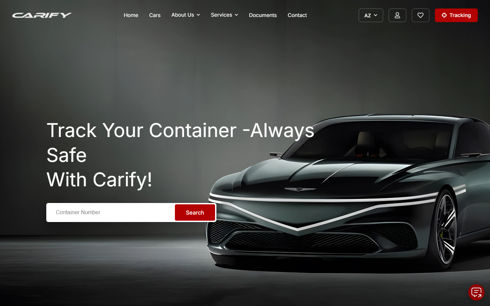
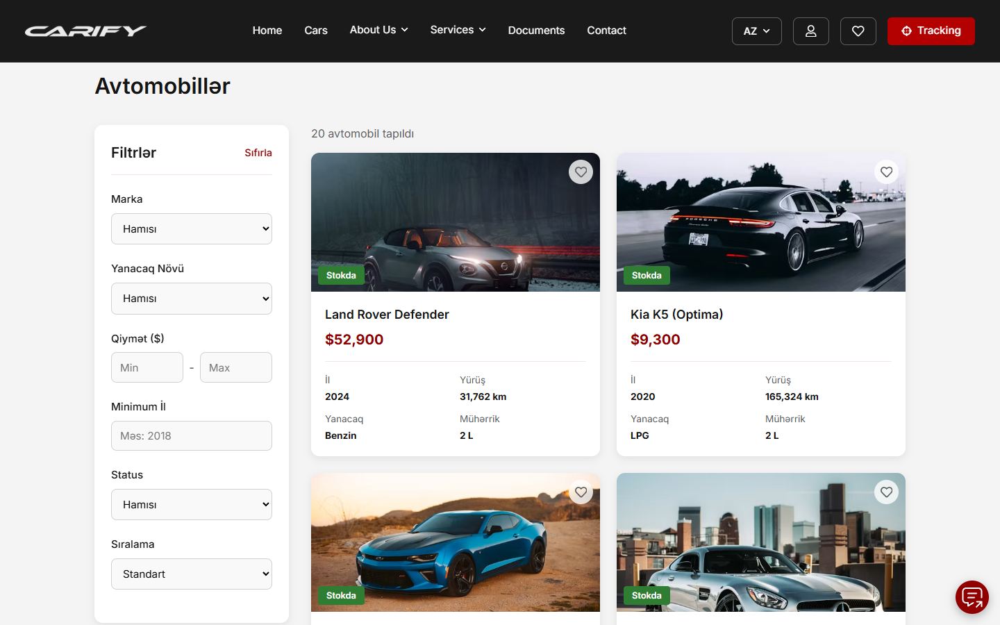
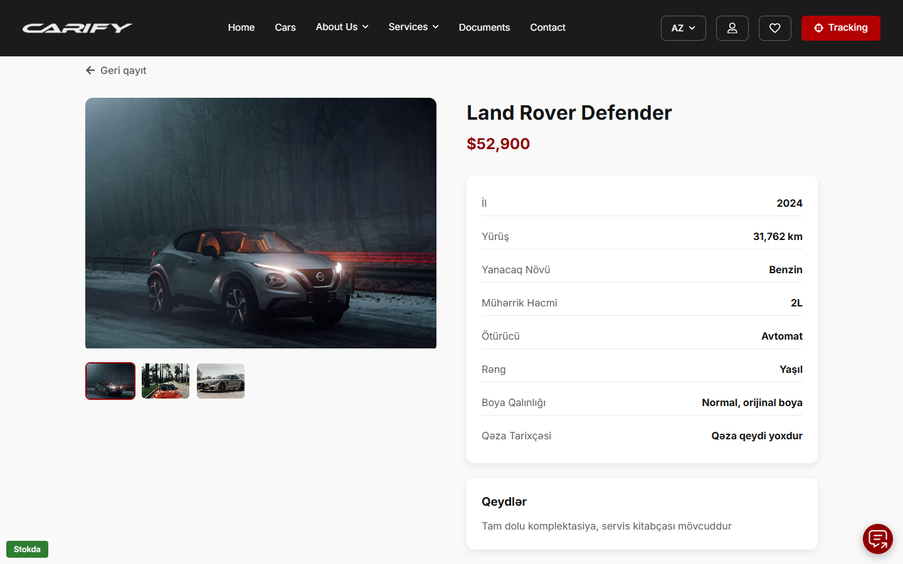
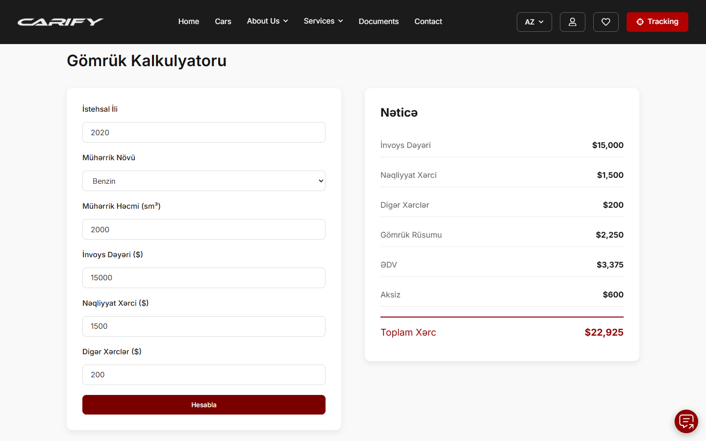

# Carify Clone

A car import and shipping website modelled on [carify-global.com](https://carify-global.com), built as a solo learning project. Users can browse a car catalog, estimate customs costs, track shipments and order a car.

> Educational project. Not affiliated with Carify.



## Features

- **Car catalog:** list and detail pages with a filter sidebar (brand, price, year, fuel type, status) and sorting
- **Car order form:** order request from the car detail page, saved through the API
- **Customs cost calculator:** estimates import costs from customs rates stored in the database
- **Shipments and tracking:** list of active shipments and a tracking page with a Google Maps view
- **Wishlist:** save cars to a personal wishlist
- **Auth:** sign-up and login
- **Content pages:** blog with detail pages, about, FAQ, contact
- **Multi-language UI (AZ/EN/RU)** with i18next

| Catalog | Car detail | Customs calculator |
|---|---|---|
|  |  |  |

## Tech stack

| Layer | Tools |
|---|---|
| Frontend | React, Vite, React Router, Context API, Axios, React Icons |
| i18n | i18next, react-i18next |
| Data | json-server (mock REST API) |
| Integrations | Google Maps Static API |

## Getting started

**Requirements:** Node.js 20+.

```bash
git clone https://github.com/saidmuradkhan/Carify.git
cd Carify
npm install
```

Create a `.env` file in the project root (optional; without it the tracking page shows an embedded map instead):

```
VITE_GOOGLE_MAPS_API_KEY=your_key_here
```

Run the mock API and the frontend in separate terminals:

```bash
npx json-server --watch db.json --port 3001   # API      -> http://localhost:3001
npm run dev                                   # frontend -> http://localhost:5173
```

### Mock API resources (`db.json`)

`cars`, `brands`, `carOrders`, `customsRates`, `shipments`, `blogPosts`, `reviews`, `faq`, `team`, `users`

## Project structure

```
src/
  api/            Axios client
  Components/     Cars, Calculator, Tracking, Shipments, Wishlist, Auth, Blog, Home, Layout, ...
  context/        AuthContext, WishlistContext
  i18n/           i18next setup and AZ/EN/RU locale files
  pages/          HomePage
db.json           Mock data for json-server
```

## Author

**Said Muradkhan**: [GitHub](https://github.com/saidmuradkhan) · [LinkedIn](https://www.linkedin.com/in/said-muradkhan-0103a2350/)
